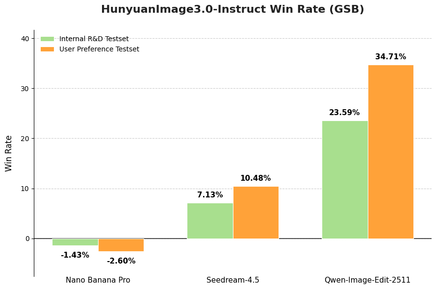
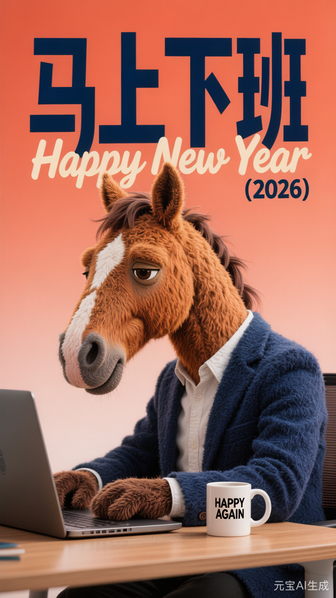
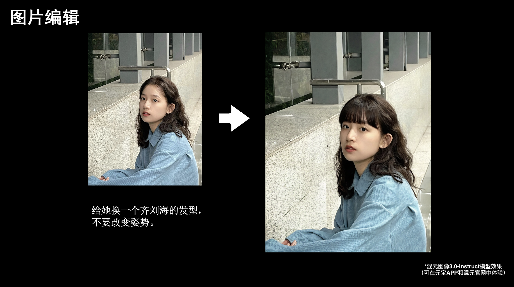
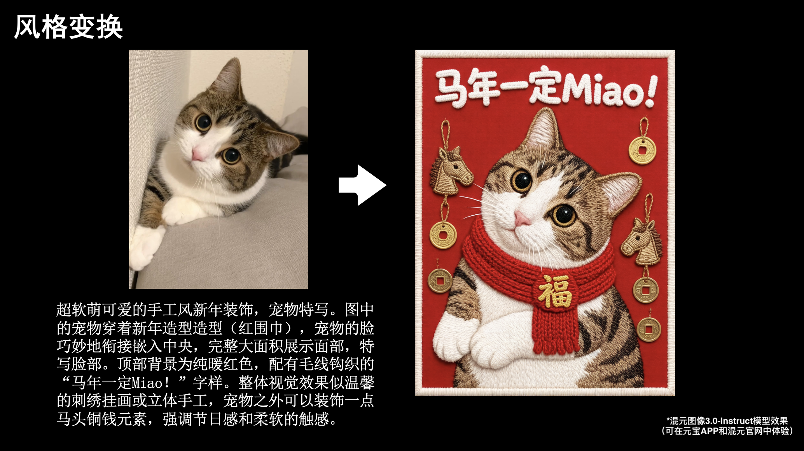
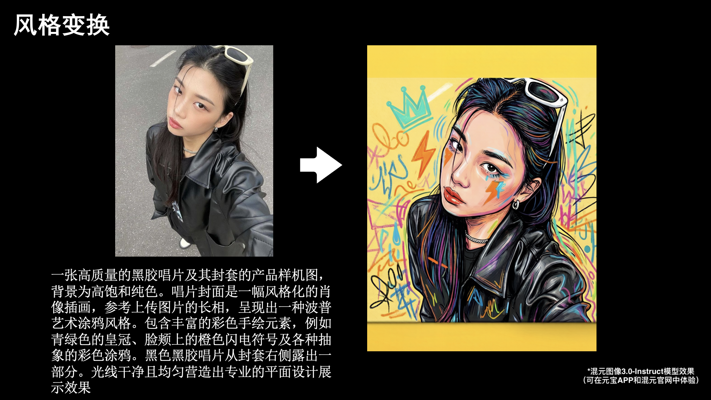
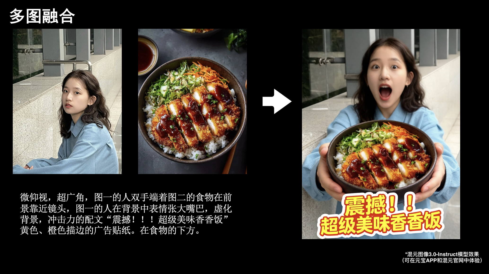

[中文文档](./README_zh_CN.md)

<div align="center">


# 🎨 HunyuanImage-3.0: A Powerful Native Multimodal Model for Image Generation

</div>


<div align="center">


</div>

<div align="center">
  <a href=https://hunyuan.tencent.com/image target="_blank"></a>
  <a href=https://huggingface.co/tencent/HunyuanImage-3.0 target="_blank"></a>
  <a href=https://github.com/Tencent-Hunyuan/HunyuanImage-3.0 target="_blank"></a>
  <a href=https://arxiv.org/pdf/2509.23951 target="_blank"></a>
  <a href=https://x.com/TencentHunyuan target="_blank"></a>
  <a href=https://docs.qq.com/doc/DUVVadmhCdG9qRXBU target="_blank"></a>
</div>


<p align="center">
    👏 Join our <a href="./assets/WECHAT.md" target="_blank">WeChat</a> and <a href="https://discord.gg/ehjWMqF5wY">Discord</a> | 
💻 <a href="https://hunyuan.tencent.com/modelSquare/home/play?modelId=289&from=/visual">Official website(官网) Try our model!</a>&nbsp&nbsp
</p>

## 🔥🔥🔥 News

- **January 26, 2026**: 🚀 **[HunyuanImage-3.0-Instruct-Distil](https://huggingface.co/tencent/HunyuanImage-3.0-Instruct-Distil)** - Distilled checkpoint for efficient deployment (8 steps sampling recommended).
- **January 26, 2026**: 🎉 **[HunyuanImage-3.0-Instruct](https://huggingface.co/tencent/HunyuanImage-3.0-Instruct)** - Release of **Instruct (with reasoning)** for intelligent prompt enhancement and **Image-to-Image** generation for creative editing.
- **October 30, 2025**: 🚀 **[HunyuanImage-3.0 vLLM Acceleration](./vllm_infer/README.md)** - Significantly faster inference with vLLM support.
- **September 28, 2025**: 📖 **[HunyuanImage-3.0 Technical Report](https://arxiv.org/pdf/2509.23951)** - Comprehensive technical documentation now available.
- **September 28, 2025**: 🎉 **[HunyuanImage-3.0 Open Source](https://github.com/Tencent-Hunyuan/HunyuanImage-3.0)** - Inference code and model weights publicly available.


## 🧩 Community Contributions

If you develop/use HunyuanImage-3.0 in your projects, welcome to let us know.

## 📑 Open-source Plan

- HunyuanImage-3.0 (Image Generation Model)
  - [x] Inference 
  - [x] HunyuanImage-3.0 Checkpoints
  - [x] HunyuanImage-3.0-Instruct Checkpoints (with reasoning)
  - [x] vLLM Support
  - [x] Distilled Checkpoints
  - [x] Image-to-Image Generation
  - [ ] Multi-turn Interaction


## 🗂️ Contents
- [🔥🔥🔥 News](#-news)
- [🧩 Community Contributions](#-community-contributions)
- [📑 Open-source Plan](#-open-source-plan)
- [📖 Introduction](#-introduction)
- [✨ Key Features](#-key-features)
- [🚀 Usage](#-usage)
  - [📦 Environment Setup](#-environment-setup)
    - [📥 Install Dependencies](#-install-dependencies)
  - [HunyuanImage-3.0-Instruct](#hunyuanimage-30-instruct-instruction-reasoning-and-image-to-image-generation-including-editing-and-multi-image-fusion)
    - [🔥 Quick Start with Transformers](#-quick-start-with-transformers)
      - [1️⃣ Download model weights](#1-download-model-weights)
      - [2️⃣ Run with Transformers](#2-run-with-transformers)
    - [🏠 Local Installation & Usage](#-local-installation--usage)
      - [1️⃣ Clone the Repository](#1-clone-the-repository)
      - [2️⃣ Download Model Weights](#2-download-model-weights)
      - [3️⃣ Run the Demo](#3-run-the-demo)
      - [4️⃣ Command Line Arguments](#4-command-line-arguments)
      - [5️⃣ For fewer Sampling Steps](#5-for-fewer-sampling-steps)
  - [HunyuanImage-3.0 (Text-to-image)](#hunyuanimage-30-text-to-image)
    - [🔥 Quick Start with Transformers](#-quick-start-with-transformers-1)
      - [1️⃣ Download model weights](#1-download-model-weights-1)
      - [2️⃣ Run with Transformers](#2-run-with-transformers-1)
    - [🏠 Local Installation & Usage](#-local-installation--usage-1)
      - [1️⃣ Clone the Repository](#1-clone-the-repository-1)
      - [2️⃣ Download Model Weights](#2-download-model-weights-1)
      - [3️⃣ Run the Demo](#3-run-the-demo-1)
      - [4️⃣ Command Line Arguments](#4-command-line-arguments-1)
    - [🎨 Interactive Gradio Demo](#-interactive-gradio-demo)
      - [1️⃣ Install Gradio](#1-install-gradio)
      - [2️⃣ Configure Environment](#2-configure-environment)
      - [3️⃣ Launch the Web Interface](#3-launch-the-web-interface)
      - [4️⃣ Access the Interface](#4-access-the-interface)
- [🧱 Models Cards](#-models-cards)
- [📊 Evaluation](#-evaluation)
  - [Evaluation of HunyuanImage-3.0-Instruct](#evaluation-of-hunyuanimage-30-instruct)
  - [Evaluation of HunyuanImage-3.0 (Text-to-Image)](#evaluation-of-hunyuanimage-30-text-to-image)
- [🖼️ Showcase](#-showcase)
  - [Showcases of HunyuanImage-3.0-Instruct](#showcases-of-hunyuanimage-30-instruct)
- [📚 Citation](#-citation)
- [🙏 Acknowledgements](#-acknowledgements)
- [🌟🚀 Github Star History](#-github-star-history)

---

## 📖 Introduction

**HunyuanImage-3.0** is a groundbreaking native multimodal model that unifies multimodal understanding and generation within an autoregressive framework. Our text-to-image and image-to-image model achieves performance **comparable to or surpassing** leading closed-source models.


<div align="center">
  
</div>

## ✨ Key Features

* 🧠 **Unified Multimodal Architecture:** Moving beyond the prevalent DiT-based architectures, HunyuanImage-3.0 employs a unified autoregressive framework. This design enables a more direct and integrated modeling of text and image modalities, leading to surprisingly effective and contextually rich image generation.

* 🏆 **The Largest Image Generation MoE Model:** This is the largest open-source image generation Mixture of Experts (MoE) model to date. It features 64 experts and a total of 80 billion parameters, with 13 billion activated per token, significantly enhancing its capacity and performance.

* 🎨 **Superior Image Generation Performance:** Through rigorous dataset curation and advanced reinforcement learning post-training, we've achieved an optimal balance between semantic accuracy and visual excellence. The model demonstrates exceptional prompt adherence while delivering photorealistic imagery with stunning aesthetic quality and fine-grained details.

* 💭 **Intelligent Image Understanding and World-Knowledge Reasoning:** The unified multimodal architecture endows HunyuanImage-3.0 with powerful reasoning capabilities. It under stands user's input image, and leverages its extensive world knowledge to intelligently interpret user intent, automatically elaborating on sparse prompts with contextually appropriate details to produce superior, more complete visual outputs.


## 🚀 Usage

### 📦 Environment Setup

* 🐍 **Python:** 3.12+ (recommended and tested)
* ⚡ **CUDA:** 12.8

#### 📥 Install Dependencies

```bash
# 1. First install PyTorch (CUDA 12.8 Version)
pip install torch==2.8.0 torchvision==0.23.0 torchaudio==2.8.0 --index-url https://download.pytorch.org/whl/cu128

# 2. Install tencentcloud-sdk for Prompt Enhancement (PE) only for HunyuanImage-3.0 not HunyuanImage-3.0-Instruct
pip install -i https://mirrors.tencent.com/pypi/simple/ --upgrade tencentcloud-sdk-python

# 3. Then install other dependencies
pip install -r requirements.txt
```

For **up to 3x faster inference**, install these optimizations:

```bash
# FlashInfer for optimized moe inference. v0.5.0 is tested.
pip install flashinfer-python==0.5.0
```
> 💡**Installation Tips:** It is critical that the CUDA version used by PyTorch matches the system's CUDA version. 
> FlashInfer relies on this compatibility when compiling kernels at runtime.
> GCC version >=9 is recommended for compiling FlashAttention and FlashInfer.

> ⚡ **Performance Tips:** These optimizations can significantly speed up your inference!

> 💡**Notation:** When FlashInfer is enabled, the first inference may be slower (about 10 minutes) due to kernel compilation. Subsequent inferences on the same machine will be much faster.

### HunyuanImage-3.0-Instruct (Instruction reasoning and Image-to-image generation, including editing and multi-image fusion)

#### 🔥 Quick Start with Transformers

##### 1️⃣ Download model weights

```bash
# Download from HuggingFace and rename the directory.
# Notice that the directory name should not contain dots, which may cause issues when loading using Transformers.
hf download tencent/HunyuanImage-3.0-Instruct --local-dir ./HunyuanImage-3-Instruct
```

##### 2️⃣ Run with Transformers

```python
from transformers import AutoModelForCausalLM

# Load the model
model_id = "./HunyuanImage-3-Instruct"
# Currently we can not load the model using HF model_id `tencent/HunyuanImage-3.0-Instruct` directly 
# due to the dot in the name.

kwargs = dict(
    attn_implementation="sdpa", 
    trust_remote_code=True,
    torch_dtype="auto",
    device_map="auto",
    moe_impl="eager",   # Use "flashinfer" if FlashInfer is installed
    moe_drop_tokens=True,
)

model = AutoModelForCausalLM.from_pretrained(model_id, **kwargs)
model.load_tokenizer(model_id)

# Image-to-Image generation (TI2I)
prompt = "基于图一的logo，参考图二中冰箱贴的材质，制作一个新的冰箱贴"

input_img1 = "./assets/demo_instruct_imgs/input_1_0.png"
input_img2 = "./assets/demo_instruct_imgs/input_1_1.png"
imgs_input = [input_img1, input_img2]

cot_text, samples = model.generate_image(
    prompt=prompt,
    image=imgs_input,
    seed=42,
    image_size="auto",
    use_system_prompt="en_unified",
    bot_task="think_recaption",  # Use "think_recaption" for reasoning and enhancement
    infer_align_image_size=True,  # Align output image size to input image size
    diff_infer_steps=50, 
    verbose=2
)

# Save the generated image
samples[0].save("image_edit.png")
```

#### 🏠 Local Installation & Usage

##### 1️⃣ Clone the Repository

```bash
git clone https://github.com/Tencent-Hunyuan/HunyuanImage-3.0.git
cd HunyuanImage-3.0/
```

##### 2️⃣ Download Model Weights

```bash
# Download from HuggingFace
hf download tencent/HunyuanImage-3.0-Instruct --local-dir ./HunyuanImage-3-Instruct
```

##### 3️⃣ Run the Demo

More demos in `run_demo_instruct.sh`.

```bash
export MODEL_PATH="./HunyuanImage-3-Instruct"
bash run_demo_instruct.sh
```

##### 4️⃣ Command Line Arguments

| Arguments               | Description                                                  | Recommended    |
| ----------------------- | ------------------------------------------------------------ | ----------- |
| `--prompt`              | Input prompt                                                 | (Required)  |
| `--image`               | Image to run. For multiple images, use comma-separated paths (e.g., 'img1.png,img2.png') | (Required)      |
| `--model-id`            | Model path                                                   | (Required)  |
| `--attn-impl`           | Attention implementation. Now only support 'sdpa'            | `sdpa`      |
| `--moe-impl`            | MoE implementation. Either `eager` or `flashinfer`           | `flashinfer`     |
| `--seed`                | Random seed for image generation. Use None for random seed   | `None`      |
| `--diff-infer-steps`    | Number of inference steps                                   | `50`        |
| `--image-size`          | Image resolution. Can be `auto`, like `1280x768` or `16:9`  | `auto`      |
| `--use-system-prompt`   | System prompt type. Options: `None`, `dynamic`, `en_vanilla`, `en_recaption`, `en_think_recaption`, `en_unified`, `custom` | `en_unified` |
| `--system-prompt`       | Custom system prompt. Used when `--use-system-prompt` is `custom` | `None`      |
| `--bot-task`            | Task type. `image` for direct generation; `auto` for text; `recaption` for re-write->image; `think_recaption` for think->re-write->image | `think_recaption` |
| `--save`                | Image save path                                              | `image.png` |
| `--verbose`             | Verbose level                                                | `2`         |
| `--reproduce`           | Whether to reproduce the results                            | `True`     |
| `--infer-align-image-size` | Whether to align the target image size to the src image size | `True`     |
| `--max_new_tokens`      | Maximum number of new tokens to generate                     | `2048` |
| `--use-taylor-cache`    | Use Taylor Cache when sampling                              | `False`     |

##### 5️⃣ For fewer Sampling Steps

We recommend using the model [HunyuanImage-3.0-Instruct-Distil](https://huggingface.co/tencent/HunyuanImage-3.0-Instruct-Distil) with `--diff-infer-steps 8`, while keeping all other recommended parameter values **unchanged**.

```bash
# Download HunyuanImage-3.0-Instruct-Distil from HuggingFace
hf download tencent/HunyuanImage-3.0-Instruct-Distil --local-dir ./HunyuanImage-3-Instruct-Distil

# Run the demo with 8 steps to samples
export MODEL_PATH="./HunyuanImage-3-Instruct-Distil"
bash run_demo_instruct_Distil.sh
```

<details>
<summary> Previous Version (Pure Text-to-Image) </summary>

### HunyuanImage-3.0 (Text-to-image)

#### 🔥 Quick Start with Transformers

##### 1️⃣ Download model weights

```bash
# Download from HuggingFace and rename the directory.
# Notice that the directory name should not contain dots, which may cause issues when loading using Transformers.
hf download tencent/HunyuanImage-3.0 --local-dir ./HunyuanImage-3
```

##### 2️⃣ Run with Transformers

```python
from transformers import AutoModelForCausalLM

# Load the model
model_id = "./HunyuanImage-3"
# Currently we can not load the model using HF model_id `tencent/HunyuanImage-3.0` directly 
# due to the dot in the name.

kwargs = dict(
    attn_implementation="sdpa",     # Use "flash_attention_2" if FlashAttention is installed
    trust_remote_code=True,
    torch_dtype="auto",
    device_map="auto",
    moe_impl="eager",   # Use "flashinfer" if FlashInfer is installed
)

model = AutoModelForCausalLM.from_pretrained(model_id, **kwargs)
model.load_tokenizer(model_id)

# generate the image
prompt = "A brown and white dog is running on the grass"
image = model.generate_image(prompt=prompt, stream=True)
image.save("image.png")
```


#### 🏠 Local Installation & Usage

##### 1️⃣ Clone the Repository

```bash
git clone https://github.com/Tencent-Hunyuan/HunyuanImage-3.0.git
cd HunyuanImage-3.0/
```

##### 2️⃣ Download Model Weights

```bash
# Download from HuggingFace
hf download tencent/HunyuanImage-3.0 --local-dir ./HunyuanImage-3
```

##### 3️⃣ Run the Demo
The Pretrain Checkpoint does not automatically rewrite or enhance input prompts, for optimal results currently, we recommend community partners to use deepseek to rewrite the prompts. You can go to [Tencent Cloud](https://cloud.tencent.com/document/product/1772/115963#.E5.BF.AB.E9.80.9F.E6.8E.A5.E5.85.A5) to apply for an API Key.

```bash
# Without PE
export MODEL_PATH="./HunyuanImage-3"
python3 run_image_gen.py \
    --model-id $MODEL_PATH \
    --verbose 1 \
    --prompt "A brown and white dog is running on the grass" \
    --bot-task image \
    --image-size "1024x1024" \
    --save ./image.png \
    --moe-impl flashinfer

# With PE
export DEEPSEEK_KEY_ID="your_deepseek_key_id"
export DEEPSEEK_KEY_SECRET="your_deepseek_key_secret"
export MODEL_PATH="./HunyuanImage-3"
python3 run_image_gen.py \
    --model-id $MODEL_PATH \
    --verbose 1 \
    --prompt "A brown and white dog is running on the grass" \
    --bot-task image \
    --image-size "1024x1024" \
    --save ./image.png \
    --moe-impl flashinfer \
    --rewrite 1

```

##### 4️⃣ Command Line Arguments

| Arguments               | Description                                                  | Recommended     |
| ----------------------- | ------------------------------------------------------------ | ----------- |
| `--prompt`              | Input prompt                                                 | (Required)  |
| `--model-id`            | Model path                                                   | (Required)  |
| `--attn-impl`           | Attention implementation. Either `sdpa` or `flash_attention_2`. | `sdpa`      |
| `--moe-impl`            | MoE implementation. Either `eager` or `flashinfer`           | `flashinfer`     |
| `--seed`                | Random seed for image generation                             | `None`      |
| `--diff-infer-steps`    | Diffusion infer steps                                        | `50`        |
| `--image-size`          | Image resolution. Can be `auto`, like `1280x768` or `16:9`   | `auto`      |
| `--save`                | Image save path.                                             | `image.png` |
| `--verbose`             | Verbose level. 0: No log; 1: log inference information.      | `0`         |
| `--rewrite`             | Whether to enable rewriting                                  | `1`         |

#### 🎨 Interactive Gradio Demo

Launch an interactive web interface for easy text-to-image generation.

##### 1️⃣ Install Gradio

```bash
pip install gradio>=4.21.0
```

##### 2️⃣ Configure Environment

```bash
# Set your model path
export MODEL_ID="path/to/your/model"

# Optional: Configure GPU usage (default: 0,1,2,3)
export GPUS="0,1,2,3"

# Optional: Configure host and port (default: 0.0.0.0:443)
export HOST="0.0.0.0"
export PORT="443"
```

##### 3️⃣ Launch the Web Interface

**Basic Launch:**
```bash
sh run_app.sh
```

**With Performance Optimizations:**
```bash
# Use both optimizations for maximum performance
sh run_app.sh --moe-impl flashinfer --attn-impl flash_attention_2
```

##### 4️⃣ Access the Interface

> 🌐 **Web Interface:** Open your browser and navigate to `http://localhost:443` (or your configured port)


## 🧱 Models Cards

| Model                     | Params | Download | Recommended VRAM | Supported |
|---------------------------| --- | --- | --- | --- |
| HunyuanImage-3.0          | 80B total (13B active) | [HuggingFace](https://huggingface.co/tencent/HunyuanImage-3.0) | ≥ 3 × 80 GB | ✅ Text-to-Image
| HunyuanImage-3.0-Instruct | 80B total (13B active) | [HuggingFace](https://huggingface.co/tencent/HunyuanImage-3.0-Instruct) | ≥ 8 × 80 GB | ✅ Text-to-Image<br>✅ Text-Image-to-Image<br>✅ Prompt Self-Rewrite <br>✅ CoT Think
| HunyuanImage-3.0-Instruct-Distil | 80B total (13B active) | [HuggingFace](https://huggingface.co/tencent/HunyuanImage-3.0-Instruct-Distil) | ≥ 8 × 80 GB |✅ Text-to-Image<br>✅ Text-Image-to-Image<br>✅ Prompt Self-Rewrite <br>✅ CoT Think <br>✅ Fewer sampling steps (8 steps recommended) 

Notes:
- Install performance extras (FlashAttention, FlashInfer) for faster inference.
- Multi‑GPU inference is recommended for the Base model.

</details>

## 📊 Evaluation

### Evaluation of HunyuanImage-3.0-Instruct
* 👥 **GSB (Human Evaluation)** 
We adopted the GSB (Good/Same/Bad) evaluation method commonly used to assess the relative performance between two models from an overall image perception perspective. In total, we utilized 1,000+ single- and multi-images editing cases, generating an equal number of image samples for all compared models in a single run. For a fair comparison, we conducted inference only once for each prompt, avoiding any cherry-picking of results. When comparing with the baseline methods, we maintained the default settings for all selected models. The evaluation was performed by more than 100 professional evaluators. 

<p align="center">
  
</p>


### Evaluation of HunyuanImage-3.0 (Text-to-Image)

* 🤖 **SSAE (Machine Evaluation)**   
SSAE (Structured Semantic Alignment Evaluation) is an intelligent evaluation metric for image-text alignment based on advanced multimodal large language models (MLLMs). We extracted 3500 key points across 12 categories, then used multimodal large language models to automatically evaluate and score by comparing the generated images with these key points based on the visual content of the images. Mean Image Accuracy represents the image-wise average score across all key points, while Global Accuracy directly calculates the average score across all key points.

<p align="center">
  
</p>

<p align="center">
  
</p>


* 👥 **GSB (Human Evaluation)** 

We adopted the GSB (Good/Same/Bad) evaluation method commonly used to assess the relative performance between two models from an overall image perception perspective. In total, we utilized 1,000 text prompts, generating an equal number of image samples for all compared models in a single run. For a fair comparison, we conducted inference only once for each prompt, avoiding any cherry-picking of results. When comparing with the baseline methods, we maintained the default settings for all selected models. The evaluation was performed by more than 100 professional evaluators. 

<p align="center">
  
</p>

## 🖼️ Showcase

Our model can follow complex instructions to generate high‑quality, creative images.

<div align="center">
  
</div>

For text-to-image showcases in HunyuanImage-3.0, click the following links:

- [HunyuanImage-3.0](./Hunyuan-Image3.md)

### Showcases of HunyuanImage-3.0-Instruct

HunyuanImage-3.0-Instruct demonstrates powerful capabilities in intelligent image generation and editing. The following showcases highlight its core features:

* 🧠 **Intelligent Visual Understanding and Reasoning (CoT Think)**: The model performs structured thinking to analyze user's input image and prompt, expand user's intent and editing tasks into a stucture, comprehnsive instructions, and leading to a better image generation and editing performance.

breaking down complex prompts and editing tasks into detailed visual components including subject, composition, lighting, color palette, and style.

* ✏️ **Prompt Self-Rewrite**: Automatically enhances sparse or vague prompts into professional-grade, detail-rich descriptions that capture the user's intent more accurately.

* 🎨 **Text-to-Image (T2I)**: Generates high-quality images from text prompts with exceptional prompt adherence and photorealistic quality.

* 🖼️ **Image-to-Image (TI2I)**: Supports creative image editing, including adding elements, removing objects, modifying styles, and seamless background replacement while preserving key visual elements.

* 🔀 **Multi-Image Fusion**: Intelligently combines multiple reference images (up to 3 inputs) to create coherent composite images that integrate visual elements from different sources.


**Showcase 1: Detailed Thought and Reasoning Process**

<div align="center">
  
</div>

**Showcase 2: Creative T2I Generation with Complex Scene Understanding**

> Prompt: 3D 毛绒质感拟人化马，暖棕浅棕肌理，穿藏蓝西装、白衬衫，戴深棕手套；疲惫带期待，坐于电脑前，旁置印 "HAPPY AGAIN" 的马克杯。橙红渐变背景，配超大号藏蓝粗体 "马上下班"，叠加米黄 "Happy New Year" 并标 "(2026)"。橙红为主，藏蓝米黄撞色，毛绒温暖柔和。

<div align="center">
  
</div>

**Showcase 3: Precise Image Editing with Element Preservation**

<div align="center">
  
</div>

**Showcase 4: Style Transformation with Thematic Enhancement**

<div align="center">
  
</div>


**Showcase 5: Advanced Style Transfer and Product Mockup Generation**

<div align="center">
  
</div>


**Showcase 6: Multi-Image Fusion and Creative Composition**

<div align="center">
  
</div>


## 📚 Citation

If you find HunyuanImage-3.0 useful in your research, please cite our work:

```bibtex
@article{cao2025hunyuanimage,
  title={HunyuanImage 3.0 Technical Report},
  author={Cao, Siyu and Chen, Hangting and Chen, Peng and Cheng, Yiji and Cui, Yutao and Deng, Xinchi and Dong, Ying and Gong, Kipper and Gu, Tianpeng and Gu, Xiusen and others},
  journal={arXiv preprint arXiv:2509.23951},
  year={2025}
}
```

## 🙏 Acknowledgements

We extend our heartfelt gratitude to the following open-source projects and communities for their invaluable contributions:

* 🤗 [Transformers](https://github.com/huggingface/transformers) - State-of-the-art NLP library
* 🎨 [Diffusers](https://github.com/huggingface/diffusers) - Diffusion models library  
* 🌐 [HuggingFace](https://huggingface.co/) - AI model hub and community
* ⚡ [FlashAttention](https://github.com/Dao-AILab/flash-attention) - Memory-efficient attention
* 🚀 [FlashInfer](https://github.com/flashinfer-ai/flashinfer) - Optimized inference engine

## 🌟🚀 Github Star History

[](https://github.com/Tencent-Hunyuan/HunyuanImage-3.0)
[](https://github.com/Tencent-Hunyuan/HunyuanImage-3.0)


[](https://www.star-history.com/#Tencent-Hunyuan/HunyuanImage-3.0&Date)
